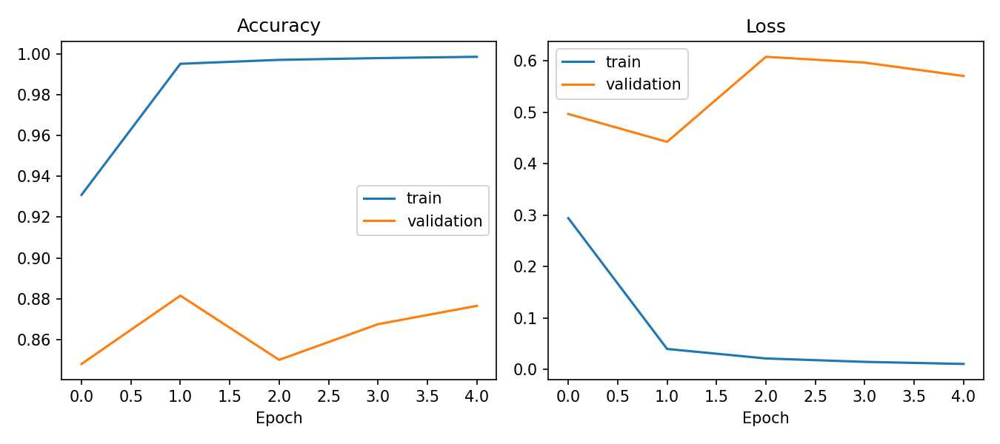

# Hand Gesture Recognition System ✋

A deep-learning application that recognizes hand gestures from images using transfer learning. The project uses the LeapGestRec dataset and provides an interactive Streamlit interface for upload- or camera-based predictions.

[](https://www.python.org/)
[](https://www.tensorflow.org/)
[](https://streamlit.io/)

## Project Overview

This project classifies a hand image into one of ten gesture categories:

`Palm`, `L`, `Fist`, `Fist Moved`, `Thumb`, `Index`, `OK`, `Palm Moved`, `C`, and `Down`.

The classifier is built with **MobileNetV2 transfer learning** and trained using the **LeapGestRec** hand gesture dataset. A Streamlit web application allows users to upload an image or capture one with a camera for instant gesture prediction.

## Results

The trained model achieved the following result on unseen test subjects:

| Metric | Score |
|---|---:|
| Test Accuracy | **87.20%** |
| Test Loss | 0.4392 |
| Training Accuracy | 99.86% |
| Validation Accuracy | 87.65% |

The dataset split was performed by subject to avoid data leakage:

- Training subjects: `00` to `06`
- Validation subject: `07`
- Test subjects: `08` and `09`

## Training Performance



The complete evaluation output is available in [test_report.txt](artifacts/test_report.txt).

### Sample Classification Performance

| Gesture | Precision | Recall | F1-score |
|---|---:|---:|---:|
| Down | 99.26% | 100.00% | 99.63% |
| Index | 99.20% | 92.75% | 95.87% |
| OK | 100.00% | 90.75% | 95.15% |
| Palm Moved | 100.00% | 85.50% | 92.18% |
| Thumb | 82.99% | 100.00% | 90.70% |

## Demo Features

- Upload a `.png`, `.jpg`, or `.jpeg` hand image
- Capture an image using the webcam
- Predict the hand gesture
- Display prediction confidence
- Show the top three predicted gestures

## Project Structure

```text
PRODIGY_ML_04/
│
├── app.py                         # Streamlit web application
├── train.py                       # Model training and evaluation script
├── gesture_utils.py               # Shared image and label utilities
├── requirements.txt               # Python dependencies
├── README.md                      # Project documentation
│
├── artifacts/
│   ├── gesture_model.keras        # Final trained model
│   ├── labels.json                # Gesture labels
│   ├── test_report.txt            # Test metrics and confusion matrix
│   └── training_history.png       # Training accuracy/loss chart
│
└── sample_image/                  # Optional test images
```

## Technologies Used

- Python
- TensorFlow / Keras
- MobileNetV2
- Streamlit
- NumPy
- Matplotlib
- Scikit-learn
- Pillow

## Dataset

The project uses the [LeapGestRec Hand Gesture Recognition Dataset](https://www.kaggle.com/datasets/gti-upm/leapgestrecog).

The dataset contains infrared hand images of ten gestures, performed by ten different subjects.

## Installation

Clone the repository:

```bash
git clone https://github.com/tripathipravardhan/PRODIGY_ML_04.git
cd PRODIGY_ML_04
```

Create and activate a virtual environment:

### Windows

```powershell
python -m venv .venv
.\.venv\Scripts\Activate.ps1
```

Install dependencies:

```powershell
python -m pip install -r requirements.txt
```

## Run the Application

```powershell
python -m streamlit run app.py
```

Open the local URL shown in the terminal, usually:

```text
http://localhost:8501
```

## Train the Model

Training was performed on Kaggle because the original dataset is large.

```bash
python train.py --data-dir path/to/leapGestRecog --epochs 12
```

The training script automatically creates:

- `gesture_model.keras`
- `labels.json`
- `best_model.keras`
- `test_report.txt`
- `training_history.png`

## Limitations

- The dataset has a controlled infrared-image background.
- Real-world images with poor lighting or busy backgrounds may reduce accuracy.
- Gesture classes such as `Fist` and `Fist Moved` can be visually similar.

## Future Improvements

- Add real-time video gesture recognition.
- Use hand detection before classification.
- Train with more diverse real-world images.
- Deploy the Streamlit application online.
- Add gesture-controlled computer actions.

## Author

**Pravardhan Tripathi**

GitHub: [tripathipravardhan](https://github.com/tripathipravardhan)

## License

This project is created for educational and internship-task purposes.
